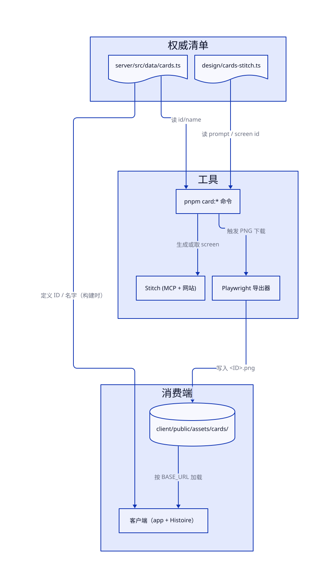
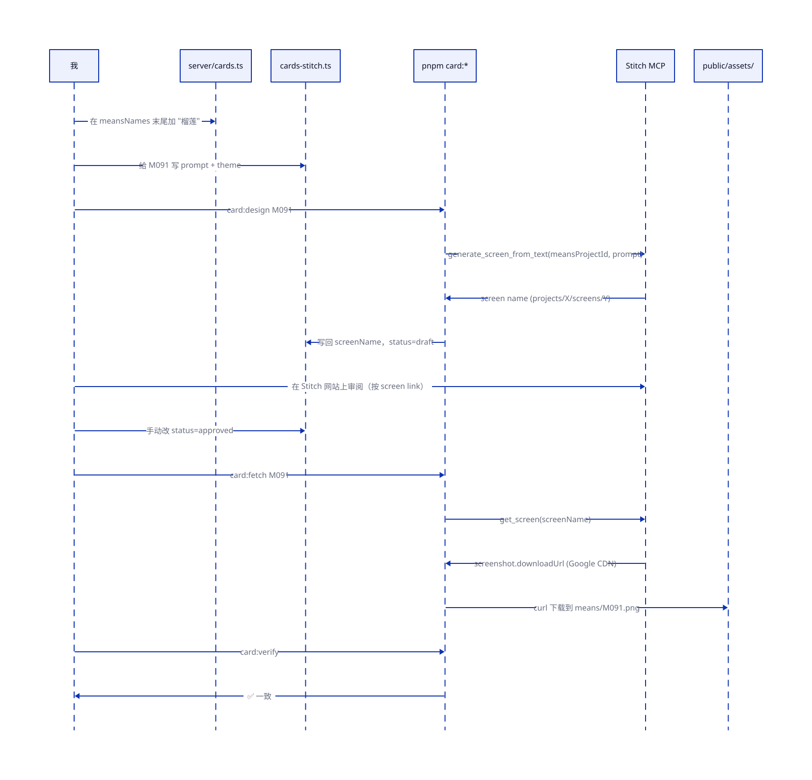
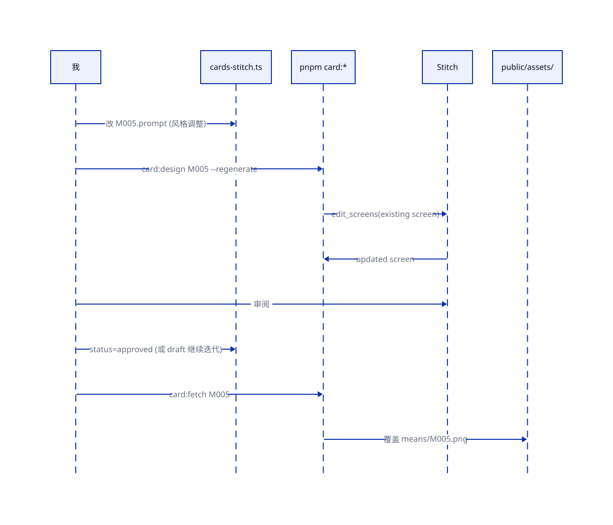

# 把 Stitch 从一次性导出变成可重放的卡牌管线

> TL;DR: 今天项目里有 357 张用 Stitch 生成的卡牌 PNG，拼起来的是一堆已经被我加进 `.gitignore` 的临时脚本——事实上"只能生成一次"。我打算把卡牌图案的开发流程改造成一条可重放的管线：server `cards.ts` 继续做 ID/名字的权威源，新增一个**设计意图 manifest**（`design/cards-stitch.ts`）保存每张卡的提示词与 Stitch screen name，配套三条命令 `card:design / card:fetch / card:verify` 串起生成、导出、校验。整条链路**纯 MCP + curl**——之前担心"Stitch 没有 PNG 导出 API 要靠 Playwright 爬网页"的判断是错的：`get_screen` 的 response 里就带 `screenshot.downloadUrl`。

## The situation

我今天刚帮你把根目录几十个 `player*-fullgame.mjs`、`export-stitch-designs.mjs`、`monitor-export-progress.mjs`、`verify-all-exports.mjs`、`stitch-export-config*.json`、一堆 `STITCH-EXPORT-*.md` 文档全部 gitignore 掉。这些是当时批量生成 357 张卡牌图案的"脚手架"——用完就扔，再也没人动过。然后我们一个小时前刚修过一个很能说明问题的 bug：客户端 mock 数据里写的是 `M01` / `C01`（2 位），图片实际命名是 `M001.png` / `C001.png`（3 位），`getMeansCardImage('M01')` 就全 404 了。

整个卡牌资源的状态是这样的：

- **权威清单**住在 `server/src/data/cards.ts`：`meansNames` 90 个中文词生成 `M001–M090`，`clueNames` 220 个生成 `C001–C220`，`ALL_EFFECT_CARDS` 10 个硬编码 `E01–E10`，`ALL_SCENE_BOARDS` 31 个硬编码 `B-CAUSE / B-LOC-A / B-SCN-01...`。
- **图片资源**住在 `client/public/assets/cards/{means,clues,effects,boards}/`，357 个 PNG。
- **两边怎么对上**靠 `client/src/types/stitch-cards.ts`：手段卡/线索卡/效果卡靠 ID 直接做文件名（`M001` → `M001.png`），场景板因为 ID 是 `B-XXX` 格式、文件是描述性命名（`board-cause-death.png`），所以多了一张 `BOARD_FILE_MAP` 手写映射表。
- **生成图片的过程**没有留下可跑的脚本——之前的方式是"打开 Stitch 网站，一张一张设计，截图，改名，丢进 assets 目录"，以及一批 Playwright 脚本把这个半自动化了一阵子，但现在那些脚本已经被我排除出仓库。而且我刚去 Stitch 上查了实际的项目结构：当时用的居然是"**每张卡 = 一个 Stitch project**"（`screenInstances: null`），这是反常的用法——Stitch 正常的组织方式是一个 project 装很多 screens。大概是因为当时没摸清 screen 级别能怎么被程序拿到，索性一张卡就建一个 project，靠 `thumbnailScreenshot.downloadUrl` 下载。

所以如果你现在让我"加一张新手段卡 M091 = 榴莲"，我要做的是：在 `cards.ts` 加一个中文词（这步很顺），然后……对着空气挥手，因为**没有可复现的流程把这张图生出来、命名对、放对位置**。今天的 2/3 位 ID bug 本质是同类问题的症状：缺乏校验就会漂移。

但有一件事我最开始是搞错了的。我原本以为 Stitch MCP **完全没有 PNG 导出能力**——因为工具列表里没有 `export_png` 这种名字，所以默认要走 Playwright。**今天真去调一次 `get_screen` 才发现根本不是那样**：

```json
{
  "name": "projects/.../screens/...",
  "screenshot": {
    "downloadUrl": "https://lh3.googleusercontent.com/aida/...",
    "name": "projects/.../files/..."
  },
  "htmlCode": {
    "downloadUrl": "https://contribution.usercontent.google.com/download?...",
    "mimeType": "text/html"
  }
}
```

每个 screen 都带一个 **Google CDN 上的 PNG 直链**，外加一个 HTML 源码直链。`curl -o <ID>.png "$downloadUrl"` 就能下。`get_project` 响应里也有同形状的 `thumbnailScreenshot.downloadUrl`（项目级缩略图）。下文的方案是围绕这个事实建的。

## What I considered

我在脑子里走了三条路。

**A. 什么都不做，继续手工**。现有图片已经齐，短期能跑。问题是：下次加卡、改风格、或者你觉得某张图不满意想重画，我们又会开始造一次性脚本，两三个月后仓库里又会堆满 `regenerate-clue-*.mjs`。这不是一个工作流，是一个坏习惯的循环。

**B. 走完全自动化**。写脚本枚举 `meansNames`，对每个名字拼提示词调 Stitch MCP 批量出图，批量 curl 下载，全部一条命令跑完。我差点选这条——直到我想清楚 Stitch 的生成质量实际上很不稳，同一个提示词能给出一张很棒和一张不能看的两张图。批量自动化意味着**不可挑选**，最后要么接受大量糟糕的图，要么人工去挑，挑的时候缺一个"哪些已经看过、哪些已经通过"的记录。这条路其实是在把"质量门"从流程里删掉。而且 `generate_screen_from_text` 文档里明写"本调用可能需要几分钟"——90 张手段卡一张一张走至少是几小时级别的挂机任务，对节奏也不友好。

**C. 介于 A 和 B 之间：manifest 驱动 + 单卡半自动**。每张卡都有"设计意图"（提示词、主题色、对应的 Stitch screen name、状态 draft/approved），图片的生成是一张一张点的命令，但命名、归档、校验是脚本做的。我选这条。

决定树大致是这样的：想不想要可重放？（要。）想不想要一键批量？（不想，质量不稳而且每张都要跑几分钟。）那就是 manifest + 每次一张的 CLI——也就是 C。

## What I'm doing

把卡牌资源管线拆成三个稳定的部分：**两个 manifest、三条命令、一个校验关卡**。



```d2
# diagrams/stitch-card-workflow/pipeline.d2
vars: { d2-config: { layout-engine: elk } }

source: 权威清单 {
  server_manifest: server/src/data/cards.ts { shape: document }
  design_manifest: design/cards-stitch.ts { shape: document }
}

tools: 工具 {
  cli: pnpm card:* 命令
  stitch: Stitch MCP
}

sink: 消费端 {
  assets: client/public/assets/cards/ { shape: cylinder }
  client: 客户端（app + Histoire）
}

source.server_manifest -> tools.cli: 读 id/name
source.design_manifest -> tools.cli: 读 prompt / screen name
tools.cli -> tools.stitch: generate_screen_from_text / get_screen
tools.stitch -> tools.cli: screen name + screenshot.downloadUrl
tools.cli -> sink.assets: curl 下载到 <ID>.png

source.server_manifest -> sink.client: 定义 ID / 名字（构建时）
sink.assets -> sink.client: 按 BASE_URL 加载
```

两个 manifest 的分工：

- `server/src/data/cards.ts` 保留现状，**继续管 ID 和名字**。这是游戏逻辑需要的信息，客户端/测试/引擎都靠它。
- 新建 `design/cards-stitch.ts` 专门管**图案相关的元信息**——每张卡一条记录：`id`, `stitchScreenName?`（`projects/X/screens/Y` 的完整资源名）, `prompt`, `themeColor`, `status: 'stub' | 'draft' | 'approved'`, `notes?`。这是"图长什么样"相关知识的家。之前这些信息散在那份 `stitch-export-config.json`（只到类型级，没到单卡级）、一堆 `.md` 指南、和"只在我脑子里"。

Stitch 项目结构我想改成**一类一个 project**（`Means Cards` / `Clue Cards` / `Effect Cards` / `Scene Boards`，共 4 个 project），每张卡是该 project 里的一个 screen。这比之前"一张卡一个 project"省下 117 个 project 的心智负担，而且 `list_screens(projectId)` 能一次列出某一类全部卡的 screen 和其 downloadUrl，批量轮询/校验都方便。

三条命令（跑在仓库根 `pnpm card:*`）：

1. `card:design <ID>` — 从两个 manifest 取到 name + prompt，调 `mcp__stitch__generate_screen_from_text`（新卡）或 `mcp__stitch__edit_screens`（已有卡），把返回的 `screen.name` 写回 `cards-stitch.ts`（status 自动置 `draft`），打印 Stitch 网站上的 screen URL 让我去挑变体。
2. `card:fetch <ID>` — 读 manifest 拿 `stitchScreenName`，调 `mcp__stitch__get_screen` 拿到当前的 `screenshot.downloadUrl`，`curl` 下载、按 `<ID>.png` 写到 `client/public/assets/cards/<type>/`。
3. `card:verify` — 扫 server manifest 和 assets 目录，列出：server 有但 PNG 缺失、PNG 有但 server 没定义（孤儿）、`BOARD_FILE_MAP` 覆盖不到的 board ID、design manifest 和 server manifest 名字不一致。退出码非零则 CI 失败。

校验关卡放在 CI 的构建前一步，保证"加了卡没画图"或"ID 格式不对齐"这类问题在 PR 里就被抓到——就是今天那个 2/3 位 bug 本应被拦下的位置。

## How it works

两个典型场景——新增和更新——走不同的路径。

**新增一张卡**（比如 M091 = 榴莲）：



```d2
# diagrams/stitch-card-workflow/flow-add.d2
shape: sequence_diagram

dev: 我
server: server/cards.ts
design: cards-stitch.ts
cli: pnpm card:*
stitch: Stitch MCP
assets: public/assets/

dev -> server: 在 meansNames 末尾加 "榴莲"
dev -> design: 给 M091 写 prompt + theme
dev -> cli: card:design M091
cli -> stitch: generate_screen_from_text(meansProjectId, prompt)
stitch -> cli: screen name (projects/X/screens/Y)
cli -> design: 写回 screenName，status=draft
dev -> stitch: 在 Stitch 网站上审阅（按 screen link）
dev -> design: 手动改 status=approved
dev -> cli: card:fetch M091
cli -> stitch: get_screen(screenName)
stitch -> cli: screenshot.downloadUrl (Google CDN)
cli -> assets: curl 下载到 means/M091.png
dev -> cli: card:verify
cli -> dev: ✅ 一致
```

**更新一张卡的图案**（已经 approved 过，但我不满意）：



```d2
# diagrams/stitch-card-workflow/flow-update.d2
shape: sequence_diagram

dev: 我
design: cards-stitch.ts
cli: pnpm card:*
stitch: Stitch MCP
assets: public/assets/

dev -> design: 改 M005.prompt (风格调整)
dev -> cli: card:design M005 --regenerate
cli -> stitch: edit_screens(existing screenName, prompt)
stitch -> cli: 更新后的 screen
dev -> stitch: 审阅
dev -> design: status=approved (或保留 draft 继续迭代)
dev -> cli: card:fetch M005
cli -> stitch: get_screen(screenName)
stitch -> cli: 新的 screenshot.downloadUrl
cli -> assets: 覆盖 means/M005.png
```

更新和新增的区别只在第一步：新增是 `generate_screen_from_text` 开新 screen（存到对应类型的 project 下），更新是 `edit_screens` 复用老 screen。

状态机很简单：`stub`（manifest 有记录但还没画）→ `draft`（已经开了 screen，在迭代）→ `approved`（已选定）。PNG 只在 `approved` 时才会被 `card:fetch` 覆写。

## What worries me

**Stitch 的生成结果不一定是"干净的单张卡片"**。`generate_screen_from_text` 是为 UI 设计优化的——给它"刀"的提示词，它可能吐出一个带标题栏、按钮、一张卡片图案的"应用界面"，而不是一张裁切好的卡牌。这比"有没有 PNG 导出"更重要，因为导出本身是通了的，但导出的**内容**对不对口是另一回事。要靠 prompt 模板约束（"画布居中一张带边框的 {theme} 色系的卡片，卡面一个 {name} 图标，无文字无 UI 元素"）——这里注定要花一轮迭代调 prompt。

**`screenshot.downloadUrl` 是短期 CDN 链接，不能缓存**。我观察到的 URL 带了签名参数（`lh3.googleusercontent.com/aida/...`），这类 Google CDN 直链通常是签名+过期的。所以 design manifest 里只应该存**稳定的 screen name**（`projects/X/screens/Y`），每次 fetch 时再调 `get_screen` 现拉 URL。如果脚本里把 URL 缓存进 manifest，几天后就全 404。

**双 manifest 漂移**。server 里加了 `M091` 但 `design/cards-stitch.ts` 忘了加条目——`card:verify` 能抓到（缺 PNG 或缺 design entry），但如果两边都加了、只是名字不一致（server 叫"榴莲"，design prompt 里写了"芒果"），verify 需要额外写一条"name 一致性"检查。

**生成质量的评审是线性瓶颈**。357 张卡里如果我想整体风格刷新一次，一张一张跑是 357 次命令 + 357 次挑选，加上每次 2–5 分钟的生成时间就是一整天以上。现在导出不再依赖 Playwright，自动化的余地确实比之前大了——但瓶颈从"导出脆弱"换成了"生成慢 + 人工审阅"，**真要大面积刷新仍然不是一条命令能搞定的**。先不做批量入口，等真的要刷新时再说。

**`BOARD_FILE_MAP` 这个手写映射表没解决**。场景板的 ID 和文件名不同构，仍然要靠它翻译。我不打算在这个管线里碰它——改场景板文件命名是独立的重构，可以放到以后。当前 verify 只检查它覆盖了所有 board ID 即可。

## Where you can push back

**你可能觉得不需要两个 manifest，在 `server/cards.ts` 上直接加几列 `prompt`/`stitchScreenName` 就行**。我选择拆开是因为 server 包本来没有"设计"这个职责，混进去会让 server 端多出一堆和游戏逻辑无关的字段（还会污染 tsc 输出体积和 tree-shake）。但如果你觉得"一份真相总比两份强"比打包清洁更重要，合进去也不是不行——只是 `design/cards-stitch.ts` 就变成 `server/src/data/cards.ts` 里的额外字段。

**你可能觉得"一类一个 project"还是"一张卡一个 project"有争议**。前者便于 `list_screens` 批量遍历和视觉上浏览一类所有卡，但 Stitch 一个 project 装 90/220 个 screen 可能卡顿。后者是之前的选择，每张卡独立但项目数量爆炸（最终会有 351 个 project）。折中方案是"每一类再按 ID 区间分 project"（比如 `M001–M030`、`M031–M060`...），但我觉得**先从"一类一个"开始**，真的卡了再拆。

## If you say "go"

会落地的东西：

- `design/cards-stitch.ts` — 新增的设计意图 manifest，先用现有的 357 张 PNG 逆向填充成 `status: 'approved'` 的记录（`stitchScreenName` 暂空，因为旧数据是"一张卡一个 project"结构，screen name 得等下一次 regenerate 时才补回去）
- `scripts/card-design.ts` — 实现 `card:design`，调 MCP `generate_screen_from_text` / `edit_screens`
- `scripts/card-fetch.ts` — 实现 `card:fetch`，调 MCP `get_screen` 拿 downloadUrl + curl 下载
- `scripts/card-verify.ts` — 实现 `card:verify`
- `package.json` — 在根 workspace 加 `card:*` 脚本
- `.github/workflows/` — 在 histoire.yml 之外加一个 `card-verify.yml`，PR 时跑 `card:verify`
- 不改 `server/src/data/cards.ts`，不改客户端的 `BOARD_FILE_MAP`，不动任何现有 PNG

测试计划：

- `card:verify` 在当前分支运行必须通过（357 张 PNG 已和 server manifest 对齐）
- 人工跑一次"加一张假卡 M999 → 看见 verify 失败 → 删除 → verify 恢复通过"的往返
- `card:design <既有 ID>`：能拿到 Stitch screen URL，`cards-stitch.ts` 被正确更新；`card:fetch <同一个 ID>`：能下载到 PNG 并覆盖到正确位置

---

Post 在 `.claude/blog/20260423-stitch-card-workflow.md`。说 "go" 开始实现，告诉我改哪里，或者 "sit on it" 先放着。
